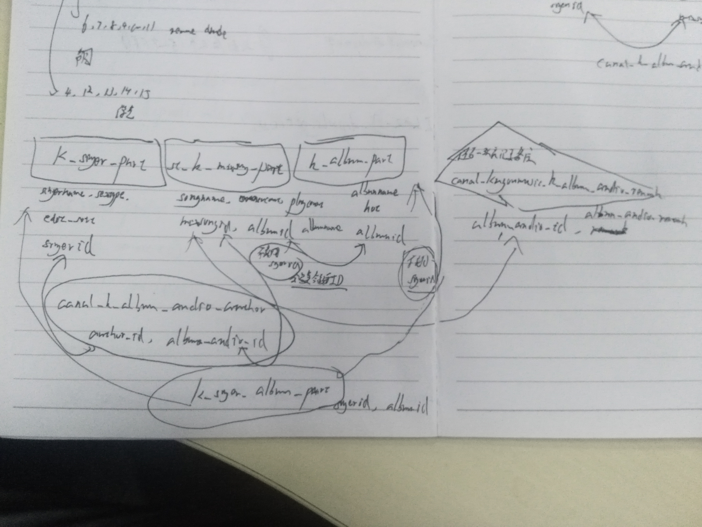

# Data

## 相关表

几张表之间的关系是：三张基础表，其中除了`k_singer_par`之外都不能使用`singerid`字段。此外还有两张连接关系表和`st_k_mixsong_part`的`albumid`与`mixsongid`字段，揭示三张基础表间的连接关系。



## 抽样研究

**说明不能用`st_k_mixsong_part`中的`singerid`，只是部分id而已。**

```hive
#根据mixsongid直接得到歌曲信息，速度快
select * from common.st_k_mixsong_part where mixsongid = '108783870' and dt='2018-11-18';

mixsongid       songname        other_info      albumid albumname       singerid        singername      language        choric_singer   extname gd_sort hash    filesize       timelength      bitrate publish_time    disc    addtime edittime        is_choric       is_single       is_break_rule   is_file_head    is_copyright    ownercount     playcount       updater upload_time     official_songname       is_recommend    editor  is_finish       is_publish      platform_break_rule     composer      lyrics   company songid  mv_hash high_mv_hash    mv_size high_mv_size    mv_type is_mv_file_head music_trac      hash_320        filesize_320    hash_m4a        m4a_size       hash_128        filesize_128    source  hash_192        filesize_192    hash_ape        filesize_ape    bitrate_ape     hash_flac       filesize_flac   bitrate_flac   scid    vip     mvid    is_search       remark  ori_audio_name  suffix_audio_name       version bpm     dt
108783870       浪人琵琶                8631706 浪人琵琶        766987  胡66    国语    胡66、单色凌    mp3     1       CF995E326627B042250C2E1B6C6809D7        358942224000   128     2018-06-21      1       2018-06-20 17:18:04     2018-11-12 11:25:45     0       1       0       100     0       2741106 469039  WB崔京琳        2018-06-20 17:18:04            0               0       1       0       单色凌  单色凌          27696032                        0       0       0       0       0       3F41EF07F1668D107C32A6852A3BE0BD       8973295         0       CF995E326627B042250C2E1B6C6809D7        3589423 32              0               0       0       B04E1C1C1C5233E4EAD3DA2E838489B0       26380958        941     38857248        0       0       0               浪人琵琶                1       72      2018-11-18
```

```
#根据mixsongid得到独立的歌手，速度一般
select * from common.canal_k_album_audio_author where album_audio_id = '108783870';

id      author_id       album_audio_id  add_time        edit_time       editor
46500161        766987  108783870       2018-06-26 18:34:13     2018-06-26 18:34:13     WB王知新
46500162        2569    108783870       2018-06-26 18:34:13     2018-06-26 18:34:13     WB王知新
```

```
#校验得到的歌手信息
select * from common.k_singer_part where singerid = '2569' and dt='2018-11-18';

singerid        singername      othername       pinyin  cindex  sex     sextype areatype        areaname        country intro   short_intro     img330  img     birthday       addtime edittime        old_id  sorts   updater res_hash        sort_offset     edit_sort       update_time     language        is_publish      hot_sort      all_pinyin       img480_640      img480  bi_sort song_count      album_count     mv_count        source  is_pack is_spread       pack_hash       img_updatetime  style identity dt
2569    单色凌  张阳    DSL     D       男歌手  1       1       大陆    中国    单色凌，酷狗直播房间号：1428573，出生于武汉，创作型歌手。擅长多种乐器，担当自己所有作品的编曲配乐以及幕后制作。@BI_COLUMN_SPLIT@2010年创作《倾城诉》《隔三秋》《蝶变》等多首原创歌曲。@BI_COLUMN_SPLIT@2011年签约伯乐爱乐经纪公司。2011年5月23日，发表首张专辑《还原色》。2012年11月29日发表首支MV《最依赖的温柔》。2013年发表《没死掉就很好》，《最后的皇后》，《两种角色》等专辑。2014年发表EP《孤单格调》，单曲《无人像你》，《执着的形状》，《战中神话》。以及首张实体唱片《小岁月太着急》。2015年发表单曲《亲爱的不能到最后》《不期而遇》。2016年1月16日发行数字专辑《梦是我唯一能找到你的地方》。单色凌，内地创作型男歌手，擅长多种乐器。        20130705160258201556.jpg        20160225174030670260.jpg        1991-11-26      2012-01-06 18:19:30     2018-04-12 11:19:49    24981   334     孟婳莹  6983020acd0af3a1734746d298773e42        -5      397     2017-05-03 19:39:21     华语    1       NULL    DanSeLing       20121122190226304.jpg  20121122190226385.jpg   2567496 114     50      33      0       1       0       d0d740e48d870b73294a145a8016f81a        2018-09-27 16:05:38     5       7     2018-11-18

select * from common.k_singer_part where singerid = '766987' and dt='2018-11-18';

singerid        singername      othername       pinyin  cindex  sex     sextype areatype        areaname        country intro   short_intro     img330  img     birthday       addtime edittime        old_id  sorts   updater res_hash        sort_offset     edit_sort       update_time     language        is_publish      hot_sort      all_pinyin       img480_640      img480  bi_sort song_count      album_count     mv_count        source  is_pack is_spread       pack_hash       img_updatetime  style identity dt
766987  胡66    胡睿    H66     H       女      0       1       大陆    中国    胡66，中国内地女歌手，代表作《空空如也》，2017年10月加入酷狗直播 。@BI_COLUMN_SPLIT@@BI_COLUMN_SPLIT@从艺历程：2016年，入围超级女声全国100强。@BI_COLUMN_SPLIT@@BI_COLUMN_SPLIT@2017年10月，入驻酷狗直播，成为酷狗直播签约歌手。@BI_COLUMN_SPLIT@@BI_COLUMN_SPLIT@2018年1月，翻唱了一首叫《空空如也》的歌走红。@BI_COLUMN_SPLIT@@BI_COLUMN_SPLIT@2018年6月，发布新歌《浪人琵琶》。    胡66，华语女歌手，代表作《空空如也》          20181115142344232.jpg    1998-05-28      2017-12-14 18:30:37     2018-10-24 10:53:17     NULL    485     WB罗欣如                -9      57              华语    1     NULL                             10618130        26      10      10      32      1       0       a63238600b0a2e1d9de9e322f7a98882        2018-11-15 14:27:59     5     2018-11-18
```

**说明不能使用`k_album_part`中的singerid，只是部分id而已。**

```
#验证album表中的singerid是独立id还是部分id（现在不用复合id了。。。）
select * from common.k_album_part where albumid ='8631706' and dt='2018-11-18';

albumid albumname       other_info      img     singerid        singername      type    company publish_time    intro   language        is_publish      start_time    addtime  edittime        updater grade   grade_count     access_count    is_recommend    platform_recommend      collect_count   source  language_type   editor  is_finish      is_buy  song_count      the_first       quality hot     is_fake push_text       tme_sn  category        dt
8631706 浪人琵琶                20180620160223562693.jpg        766987  胡66、单色凌    单曲专辑        北京亿格艾科技有限公司  2018-06-21      本是花花公子 心无所属@BI_COLUMN_SPLIT@@BI_COLUMN_SPLIT@为浪迹天涯之客 忠于自由 @BI_COLUMN_SPLIT@@BI_COLUMN_SPLIT@繁华世界，青楼酒馆@BI_COLUMN_SPLIT@@BI_COLUMN_SPLIT@常年孤身一人 乐哉乐哉 非也@BI_COLUMN_SPLIT@@BI_COLUMN_SPLIT@穿梭时空 得一红颜 悠哉悠哉@BI_COLUMN_SPLIT@@BI_COLUMN_SPLIT@自知与其不配@BI_COLUMN_SPLIT@@BI_COLUMN_SPLIT@也愿为其看破红尘 两袖清风 @BI_COLUMN_SPLIT@@BI_COLUMN_SPLIT@奈何只是美梦一场@BI_COLUMN_SPLIT@@BI_COLUMN_SPLIT@亦学会了情为何物@BI_COLUMN_SPLIT@@BI_COLUMN_SPLIT@浪子回头金不换 心痛则动  国语  0000-00-00 00:00:00      2018-06-20 16:00:52     2018-07-09 12:33:51     柯冰梓  8.0     636     0       1       0       0       0       1       姚志辉  0       0     90443    0       {"is_push":0,"push_text_pay":"我的最新专辑【《albumname》】火爆售卖中","push_text_free":"发布专辑：《albumname》"}              1       2018-11-18
```

**结果显示可以用`k_singer_album_part`来显示singer和album之间的关系。**

```
#检查k_singer_album是否能用
select * from common.k_singer_album_part where albumid = '8631706' and dt='2018-11-18';

id      singerid        singername      albumid addtime dt
4445342 766987  胡66    8631706 2018-06-20 17:18:04     2018-11-18
4445343 2569    单色凌  8631706 2018-06-20 17:18:04     2018-11-18
```

## 数据提取


