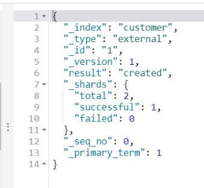
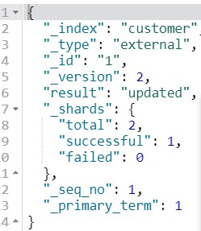
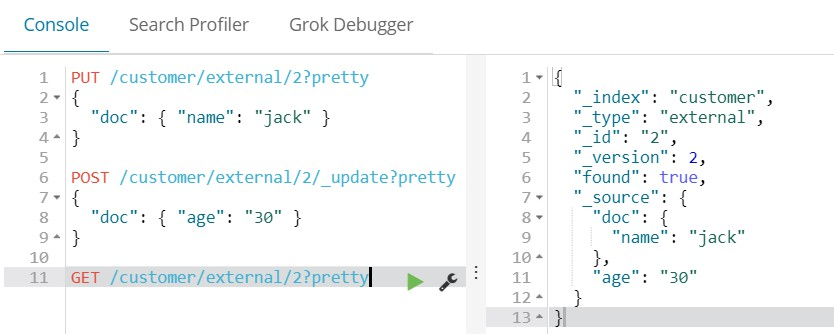

#Grammer

## 基本概念

### Elasticsearch其实就是数据库，与传统数据库的关系如下

**Relational DB -> Databases -> Tables -> Rows -> Columns**

**Elasticsearch -> Indices -> Types -> Documents -> Fields**

### Node 与 Cluster

Elastic 本质上是一个分布式数据库，允许多台服务器协同工作，每台服务器可以运行多个 Elastic 实例。

单个 Elastic 实例称为一个节点（node）。一组节点构成一个集群（cluster）。

### Index

Elastic 会索引所有字段，经过处理后写入一个反向索引（Inverted Index）。查找数据的时候，直接查找该索引。

所以，Elastic 数据管理的顶层单位就叫做 Index（索引）。它是单个数据库的同义词。每个 Index （即数据库）的名字必须是小写。

下面的命令可以查看当前节点的所有 Index。

> ```
> $ curl -X GET 'http://localhost:9200/_cat/indices?v'
> ```

### Document

Index 里面单条的记录称为 Document（文档）。许多条 Document 构成了一个 Index。

Document 使用 JSON 格式表示，下面是一个例子。

> ```
> {
>   "user": "张三",
>   "title": "工程师",
>   "desc": "数据库管理"
> }
> ```

同一个 Index 里面的 Document，不要求有相同的结构（scheme），但是最好保持相同，这样有利于提高搜索效率。

### Type

Document 可以分组，比如`weather`这个 Index 里面，可以按城市分组（北京和上海），也可以按气候分组（晴天和雨天）。这种分组就叫做 Type，它是虚拟的逻辑分组，用来过滤 Document。

不同的 Type 应该有相似的结构（schema），举例来说，`id`字段不能在这个组是字符串，在另一个组是数值。这是与关系型数据库的表的[一个区别](https://www.elastic.co/guide/en/elasticsearch/guide/current/mapping.html)。性质完全不同的数据（比如`products`和`logs`）应该存成两个 Index，而不是一个 Index 里面的两个 Type（虽然可以做到）。

下面的命令可以列出每个 Index 所包含的 Type。

> ```
> $ curl 'localhost:9200/_mapping?pretty=true'
> ```

根据[规划](https://www.elastic.co/blog/index-type-parent-child-join-now-future-in-elasticsearch)，Elastic 6.x 版只允许每个 Index 包含一个 Type，7.x 版将会彻底移除 Type。

## 基本命令

###新建(PUT)与删除(DELETE)索引及文档

```
#查看集群健康状态
GET /_cat/health?v
 
#查看node列表：
GET /_cat/nodes?v
 
#列出所有的indices
GET /_cat/indices?v
 
#创建一个名称为customer的index
PUT /customer?pretty
 
#给index下的type创建一个document
PUT /customer/external/1?pretty
{
  "name": "John Doe"
}

#删除index
DELETE /customer?pretty
```

### 查找(GET)索引及文档

```
#在customer的external中查找id为1的数据
GET /customer/external/1?pretty
#查找customer的external中的所有数据
GET /customer/external/_search
#返回集群中所有索引下的所有文档
GET /_search
```

#### hits

返回结果中最重要的部分是 `hits` ，它 包含 `total` 字段来表示匹配到的文档总数，并且一个 `hits` 数组包含所查询结果的前十个文档。

在 `hits` 数组中每个结果包含文档的 `_index` 、 `_type` 、 `_id` ，加上 `_source` 字段。这意味着我们可以直接从返回的搜索结果中使用整个文档。这不像其他的搜索引擎，仅仅返回文档的ID，需要你单独去获取文档。

每个结果还有一个 `_score` ，它衡量了文档与查询的匹配程度。默认情况下，首先返回最相关的文档结果，就是说，返回的文档是按照 `_score` 降序排列的。在这个例子中，我们没有指定任何查询，故所有的文档具有相同的相关性，因此对所有的结果而言 `1` 是中性的 `_score` 。

`max_score` 值是与查询所匹配文档的 `_score` 的最大值。

#### took

`took` 值告诉我们执行整个搜索请求耗费了多少毫秒。

#### shards

`_shards` 部分 告诉我们在查询中参与分片的总数，以及这些分片成功了多少个失败了多少个。正常情况下我们不希望分片失败，但是分片失败是可能发生的。如果我们遭遇到一种灾难级别的故障，在这个故障中丢失了相同分片的原始数据和副本，那么对这个分片将没有可用副本来对搜索请求作出响应。假若这样，Elasticsearch 将报告这个分片是失败的，但是会继续返回剩余分片的结果。

#### timeout

`timed_out` 值告诉我们查询是否超时。默认情况下，搜索请求不会超时。 如果低响应时间比完成结果更重要，你可以指定 `timeout` 为 10 或者 10ms（10毫秒），或者 1s（1秒）：

```
GET /_search?timeout=10ms
```

在请求超时之前，Elasticsearch 将会返回已经成功从每个分片获取的结果。

###直接创建和替换文档(PUT)

Elasticsearch执行put创建document时是这样的：

如果指定id不存在就新增一条数据document，存在时就覆盖。

实际上创建document时ID是可选参数。如果未指定，Elasticsearch将生成一个随机ID。

不指定id创建时document需要使用POST命令 。

**可以直接通过创建document来创建index，以下命令直接新建了index。**

```
#创建和替换documents
PUT /customer/external/1?pretty
{
  "name": "John Doe"
}
PUT /customer/external/1?pretty
{
  "name": "Jane Doe"
}
POST /customer/external?pretty
{
  "name": "Jane Doe"
}
GET /customer/external/1?pretty
```

当第一次创建document时，返回`result=created`，说明是新建，版本为`version=1`。



而第二次替换时，返回`result=updated`，说明是替换，版本为`version=2`。



###更新文档不用替换全部只更新部分字段(POST)

**更新document时，则用update符号，此外使用post命令，则只更新部分字段。**

而将要更新的内容嵌套在了`doc`字段中。 

**更新的时候需要script 或者doc。但是其本身不会被放到更新的字段中去。

`ctx._source`指的是当前document。

```
#更新documents
POST /customer/external/1/_update?pretty
{
  "doc": { "name": "jack" }
}
POST /customer/external/1/_update?pretty
{
  "doc": { "name": "Jane Doe", "age": 20 }
}
POST /customer/external/1/_update?pretty
{
  "script" : "ctx._source.age += 5"
}
```

**但是如果在put阶段使用doc，就会默认被作为一个字段使用了。再用post更新则不会放到同一个字段中去**，见下图。



### 批处理


### 创建映射

索引（index）相当于数据库，类型(type)相当于数据表，映射(Mapping)相当于数据表的表结构。ElasticSearch中的映射（Mapping）用来定义一个文档，可以定义所包含的字段以及字段的类型、分词器及属性等等。

 ```
#查看所有映射
GET /_mapping
 ```

其中keyword类型适用于索引结构化的字段，比如email地址、主机名、状态码和标签。如果字段需要进行过滤(比如查找已发布博客中status属性为published的文章)、排序、聚合。**keyword类型的字段只能通过精确值搜索到。** 如果是 keyword 类型，就不用再设置 index为 not_analyzed 参数，默认就是整体。 

```
PUT entertainment
{
  "mappings": {
    "music": {
      "properties": {
        "singer": {
          "type": "keyword"
        },
        "song": {
          "type": "keyword"
        },
        "album": {
          "type": "keyword"
        }        
      }
    }
  }
}
#查看该索引的映射
GET /entertainment/_mapping
```

### 精确查找

采用term进行精确匹配，并且映射中设置为keyword

```
PUT /entertainment/music/1?pretty
{
  "singer": "周杰伦",
  "song": "告白气球",  
  "album": "周杰伦的床边故事"
}

GET entertainment/music/_search
{ 
  "query": { 
    "bool": { 
      "must": [
        {"term":{"singer":"周杰伦"}},
        {"term":{"song":"告白气球"}},
        {"term":{"album":"周杰伦的床边故事"}}
      ]
    } 
  } 
}
```


## Reference

- [官方教程《Elasticsearch - The Definitive Guide》基于2.X，部分API过时，但是内容合理](https://www.elastic.co/guide/en/elasticsearch/guide/current/index.html)
- [官方技术文档《Elasticsearch Reference》](https://www.elastic.co/guide/en/elasticsearch/reference/current/index.html)
- [映射详解](https://blog.csdn.net/napoay/article/details/73100110#12-text%E7%B1%BB%E5%9E%8B)