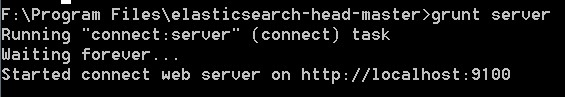
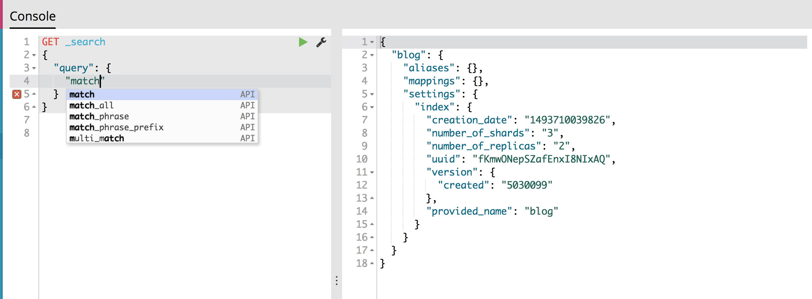

## 安装Elasticsearch

官网下载windows版本的[zip](https://www.elastic.co/downloads/elasticsearch )安装包，解压到要安装的目录下。

进入安装目录下的bin目录，双击执行elasticsearch.bat，该脚本文件执行 ElasticSearch 安装程序，稍等片刻，显示started，打开浏览器，输入 [http://localhost:9200](http://localhost:9200/) ，或者直接在命令行中输入`curl localhost:9200`。注意windows下的curl命令已经去掉了单引号了。 

```
{
  "name" : "n2zLRp8",
  "cluster_name" : "elasticsearch",
  "cluster_uuid" : "W0W1irVQRXyAqs41tPFH9w",
  "version" : {
    "number" : "6.3.0",
    "build_flavor" : "default",
    "build_type" : "zip",
    "build_hash" : "424e937",
    "build_date" : "2018-06-11T23:38:03.357887Z",
    "build_snapshot" : false,
    "lucene_version" : "7.3.1",
    "minimum_wire_compatibility_version" : "5.6.0",
    "minimum_index_compatibility_version" : "5.0.0"
  },
  "tagline" : "You Know, for Search"
}
```

上面代码中，请求9200端口，Elastic 返回一个 JSON 对象，包含当前节点、集群、版本等信息。
按下 Ctrl + C，Elastic 就会停止运行。

## 安装Head插件
###安装nodejs

#### nodejs下载

[官网](https://nodejs.org/en/download/ )下载，安装到非C盘的目录`F:\Program Files\nodejs`，为了节省之后的空间。

通过cmd，输入`node -v`和`npm -v`来判断是否安装成功。

#### 环境配置

为了避免以后的包安装到`C:\Users\用户名\AppData\Roaming\npm `中，需要设置环境变量。

首先在`F:\Program Files\nodejs`中新建两个文件夹`node_global`及`node_cache`。

然后在cmd中输入：`npm config set prefix "F:\Program Files\nodejs\node_global"`和
`npm config set cache "F:\Program Files\nodejs\node_cache"`

接下来设置环境变量，关闭cmd窗口，“我的电脑”-右键-“属性”-“高级系统设置”-“高级”-“环境变量” 。

进入环境变量对话框，在系统变量下新建`NODE_PATH`，输入`F:\Program Files\nodejs\node_global\node_modules`，将用户变量下的`Path`从`C:\Users\用户名\AppData\Roaming\npm`修改为`F:\Program Files\nodejs` 。

### 安装grunt

`npm install -g grunt -cli`

通过`grunt -version`验证安装是否成功。

### 配置head

[下载](https://github.com/mobz/elasticsearch-head)head并解压。

修改ElasticSearch的配置，在配置文件`config/elasticsearch.yml`末尾追加一下内容：

```yml
# 增加新的参数，这样head插件可以访问es
http.cors.enabled: true
http.cors.allow-origin: "*"
```

npm安装依赖，到elasticsearch-head-master目录下，运行命令： 

`npm install`

最后，在head源代码目录下启动nodejs： `grunt server`。



### 访问head

这个时候，访问[http://localhost:9100](http://localhost:9100/)就可以访问head插件了

（记得要先启动ElasticSearch，再启动head插件）

## 安装Kibana

Kibana使用html和js开发的，需要运行在Node.js，所以在下载的Kibana包中包含了Node平台。
 Kibana的版本要和Elasticsearch版本一直，不支持主版本不一致(比如5.x 和2.x)，次版本不一致(比如5.2和5.1)会在logger中打印报警信息，允许补丁版本不一致但是不建议。

解压缩到安装目录。运行bin\kibana.bat在[http://localhost:5601](http://localhost:5601/) 看是否成功。可以通过按`Ctrl-C`停止。

点击dev tools，就可以操作ES了。



**直接用git bash会出现`invalid utf-8`的编码问题，用了git-bash改了编码都不行。**

## 安装Logstash

也采用与Elasticsearch一样的版本[下载](https://www.elastic.co/cn/downloads/logstash)。


## Reference

- [全文搜索引擎 Elasticsearch 入门教程](http://www.ruanyifeng.com/blog/2017/08/elasticsearch.html)
- [windows下安装ElasticSearch](https://blog.csdn.net/qq_28988969/article/details/78851610)
- [head插件安装](https://blog.csdn.net/qq_28988969/article/details/78856599)
- [nodejs安装](https://www.cnblogs.com/zhouyu2017/p/6485265.html)